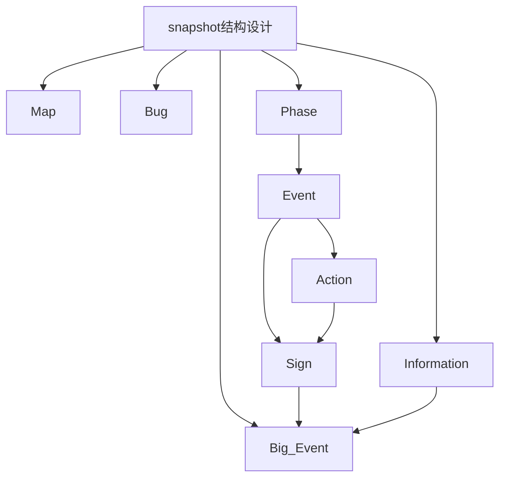

## Snapshot 快照统计与改动：

2025/4/26 21:39

----

- make_snapshot调用全在*referee.py*中，有效快照共计**36**个，无效快照**4**个。
- 为统一化快照结构，使得每个阶段由Phase到Sign，在*夜晚结束后*、*执行任务前*、*公投结束后*、*刺杀结束后*增添**1**个快照。
- 更改conduct_movement，增加**2**个快照，记录玩家的Action，记录每一次移动、每一次移动后的地图，便于可视化。

## 目前Snapshot结构设计如下，可扩展与细化：

2025/4/26 22:12

----

### Phase（阶段）：

Night、Global Speech、Move、Limited Speech、Public Vote、Mission

### Event（事件）：

阶段中的事件，如Mission Fail等

### Action（动作）：

指阶段中导致事件产生的玩家动作，如Assass等

### Sign（标识）：

指每轮游戏、每轮中阶段的结束标识，如"Global Speech phase complete"

### Information（信息）：

过程中产生的信息，如play_positions、票数比等

### Big_Event（大事件）：

Game Over、Blue Win、Red Win 1、Red Win 2

### Map（地图）：

用于可视化地图变动

### Bug:

suspend_game模块内的快照